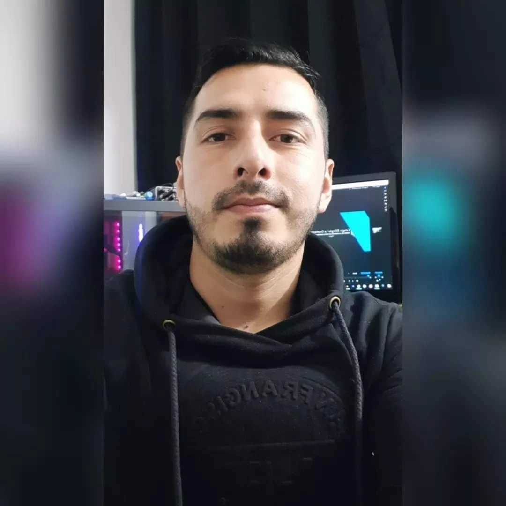

# ProgramacionVideojuegos2026
Curso Programación de Videojuegos 2026 - 2

## Diego Giovanny Caicedo Ramírez

* **Rol:** Programador Principal / Gameplay Programmer
* **Ubicación:** Bogotá, Colombia
* **Perfil:** Estudiante de Ingeniería Multimedia de la UNAD. Enfocado en la arquitectura del código del videojuego, desarrollo en Unity y diseño de los sistemas interactivos.
## Juan Camilo Molina Chacón

 
* **Role:** Technical designer
* **Location:** Bogotá, Colombia
* **profile:** Multimedia Engineering student and Multimedia Production technologist, with experience in audiovisual content creation and production, graphic design, and digital communication. Proficient in design, editing, animation, and interactive content development tools, with an interest in applying these skills to the video game industry, particularly in areas such as visual design, narrative, multimedia production, and digital experience development.
* **Rol:** Technical designer
* **Ubicación:** Bogotá, Colombia
* **Perfil:** Estudiante de Ingeniería Multimedia y tecnólogo en Producción Multimedia, con experiencia en creación y producción de contenidos audiovisuales, diseño gráfico y comunicación digital. Cuenta con conocimientos en herramientas de diseño, edición, animación y desarrollo de contenidos interactivos, con interés en aplicar estas competencias a la industria de los videojuegos, especialmente en áreas como diseño visual, narrativa, producción multimedia y desarrollo de experiencias digitales.
